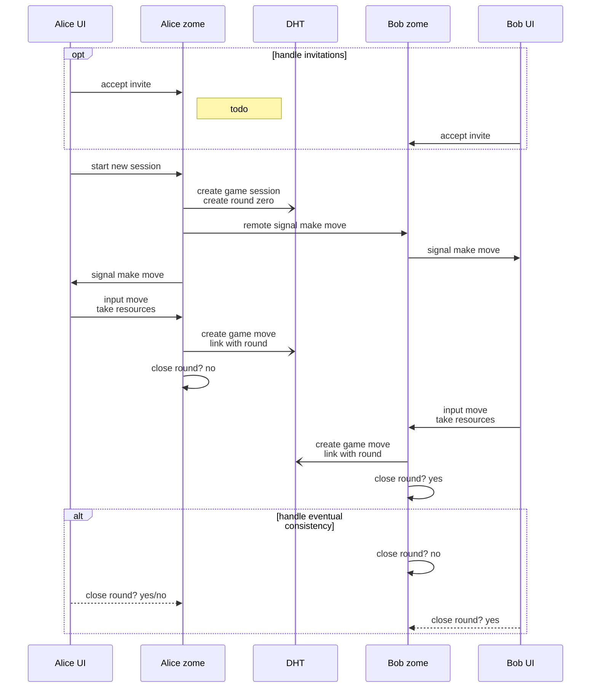
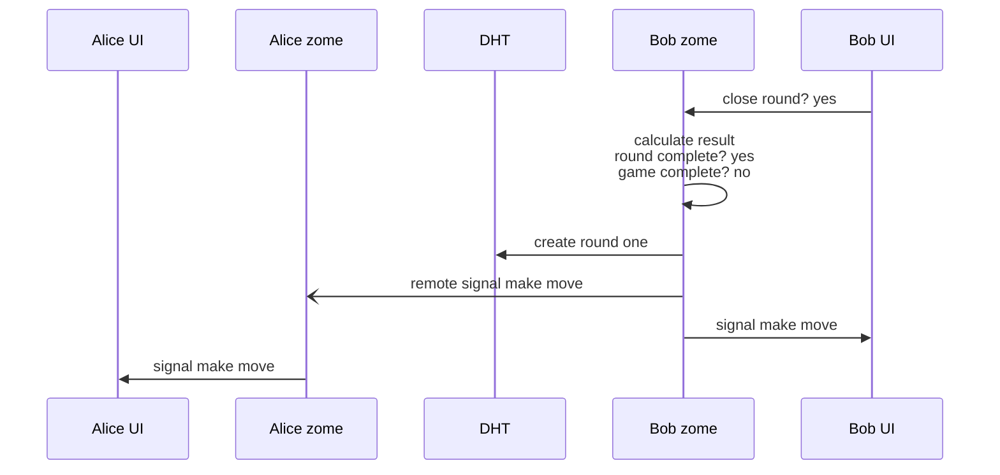
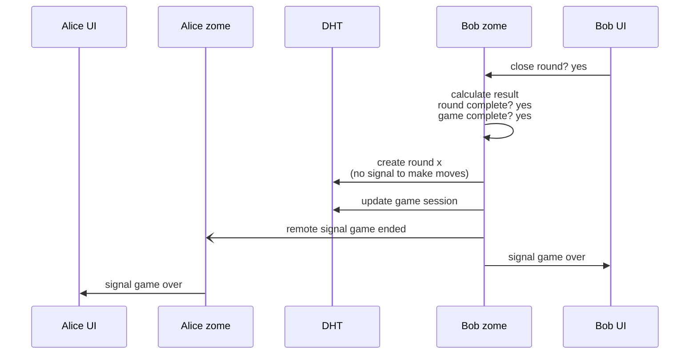

You can preview in vscode bij installing 
a plugin: vstirbu.vscode-mermaid-preview

Start of game:

```mermaid
sequenceDiagram
    participant Alice UI
    participant Alice zome
    participant DHT
    participant Bob zome
    participant Bob UI

    opt handle invitations
    Alice UI    ->>   Alice zome:  accept invite
    note right of Alice zome: todo
    Bob UI      ->>   Bob zome:    accept invite

    end

    Alice UI    ->>   Alice zome:  start new session
    Alice zome  -)   DHT:         create game session<br>create round zero
    Alice zome  ->>    Bob zome:    remote signal make move
    Bob zome    ->>   Bob UI:      signal make move
    Alice zome  ->>   Alice UI:    signal make move
    Alice UI    ->>   Alice zome:  input move<br>take resources
    Alice zome  -)    DHT:         create game move<br>link with round
    Alice zome  ->>   Alice zome:  close round? no
    Bob UI      ->>   Bob zome:    input move<br>take resources
    Bob zome    -)    DHT:         create game move<br>link with round
    Bob zome    ->>   Bob zome:    close round? yes

    alt handle eventual consistency
    Bob zome    ->>   Bob zome:    close round? no
    Alice UI    -->>  Alice zome:  close round? yes/no
    Bob UI      -->>  Bob zome:    close round? yes
    end

```

Starting next round

```mermaid
sequenceDiagram
    participant Alice UI
    participant Alice zome
    participant DHT
    participant Bob zome
    participant Bob UI

    Bob UI      ->>  Bob zome:    close round? yes
    Bob zome    ->>   Bob zome:    calculate result<br>round complete? yes<br>game complete? no
    Bob zome    ->>   DHT:         create round one
    Bob zome    -)    Alice zome:  remote signal make move
    Bob zome    ->>   Bob UI:      signal make move
    Alice zome  ->>   Alice UI:    signal make move

```

Ending game

```mermaid
sequenceDiagram
    participant Alice UI
    participant Alice zome
    participant DHT
    participant Bob zome
    participant Bob UI

    Bob UI      ->>  Bob zome:    close round? yes
    Bob zome    ->>   Bob zome:    calculate result<br>round complete? yes<br>game complete? yes
    Bob zome    ->>   DHT:         create round x<br>(no signal to make moves)
    Bob zome    ->>   DHT:         update game session
    Bob zome    -)    Alice zome:  remote signal game ended
    Bob zome    ->>   Bob UI:      signal game over
    Alice zome  ->>   Alice UI:    signal game over

```